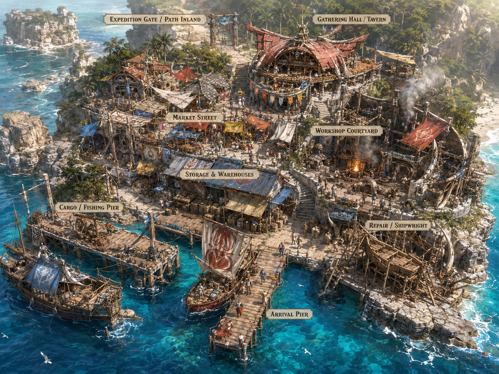

# First Harbor Town Reference Assets

第一港町の承認済みビジュアルを GitHub 上で実際に開ける画像ファイルとして保存する。

## Primary reference

- [primary-reference.png](primary-reference.png) — ユーザーが「これでいこう、素晴らしい、完璧」と承認した第一基準。配置、密度、空気感の基準にする。
- [design-board-reference.png](design-board-reference.png) — Minecraft風の全体像、配置、施設別カット、内部、導線を一枚にまとめる説明形式の基準。
- [layout-board-reference.png](layout-board-reference.png) — 区画色分け、周回ルート、高低差、施設別機能説明の参考。
- [aerial-board-reference.png](aerial-board-reference.png) — 鳥瞰配置、三段構造、プレイヤー視点のつながりを検討する参考。

## 採用する要素

- コンパクトで高密度
- 港、倉庫、市場、工房、集会所、遠征口が近い
- 海岸から内陸へ緩やかに上がる三段構造
- 非対称で増築感のある海洋フロンティア港
- 木、明るい石、帆布、ロープ、箱、船、煙、モンスター素材
- 見た目だけの空間を極力作らず、機能が景観を生む
- 建築提案は Minecraft のゲーム内見た目を優先する

GitHub上の画像は設計セッションで承認されたネイティブ解像度の元PNGをそのまま保存する。画像を一ブロック単位で複製するのではなく、本文で明示された配置・密度・空気感・機能原則を設計へ反映する。
