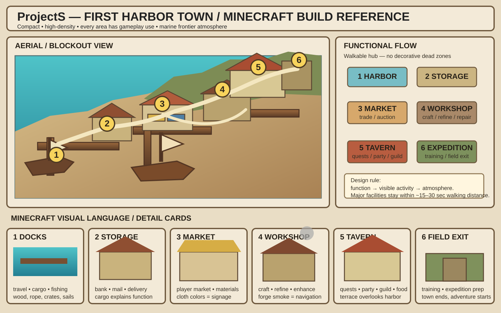

# ProjectS 第一港町 コンセプト・配置方針 v1

- **決定日:** 2026-08-09
- **ステータス:** 採用済み / 今後の設計基準
- **対象:** 第一島のホーム拠点となる港町

## 1. 一文コンセプト

**未開の巨大島の玄関口にある、明るく雑多で高密度な海洋フロンティア港。**

王都や巨大要塞ではなく、古い漁村へ交易商人、船乗り、職人、冒険者向け施設が何度も増築されて現在の姿になった町とする。明るい海と潮風、船乗り・職人・商人・冒険者が同じ場所で生活する賑わい、遠征から帰ってきたくなる安心感、巨大生物やモンスター素材が生活文化へ溶け込んでいる空気を重視する。

第一港町は序盤だけの初期村ではなく、ゲーム後半まで何度も帰ってくるホーム拠点とする。

## 2. 最重要設計原則

### 大きく見せることを目的にしない

町は巨大都市に見せなくてよい。面積ではなく、機能・生活・視覚情報の密度で魅力を出す。

### すべての区画に意味を持たせる

建物や空間には、売買・製造・保管・受注・移動・訓練などの実用機能、日常導線、ランドマーク、世界観提示、プレイヤーやNPCが集まる理由のいずれかを持たせる。

用途のない巨大広場、入れない建物だけの住宅街、何も起きない長い通路、景観専用の空き区画は極力作らない。

### 機能が景観を生む

- 魚、網、樽、小舟 → 市場・漁業・納品
- 炉、煙、金床、革、甲殻 → 製造・修理・強化
- 木箱、鉱石袋、木材 → 倉庫・配送・物流
- 長机、料理、掲示板、テラス → 集会所・食事・募集・受注
- 船体、足場、クレーン → 船便・輸送・造船

**システムを置いた結果として港町の空気が生まれる設計**を基本とする。

### 建築そのものを案内表示にする

UIや巨大看板を読まなくても用途が分かることを目指す。煙が上がる場所は工房、帆布と商品が集まる場所は市場、箱と荷車が集まる場所は倉庫、長机と人が見える高台は集会所、船と桟橋が集中する場所は港、狩猟旗とダミーと街道がある場所は遠征口とする。

## 3. 機能配置

町は海岸から内陸へ緩やかに高くなる三段構造を基本とする。

```text
                         島の内陸
                              │
                    ⑥ 遠征口・訓練区
                              │
                     ⑤ 集会所兼酒場
                        ／           ＼
              ④ 複合工房区 ─── ③ 市場通り・取引所
                        ＼           ／
                       ② 倉庫・銀行
                              │
                       ① 港・到着桟橋
                              │
                             外海
```

市場と工房は左右に分かれつつ、倉庫・集会所を介して短い周回路を形成する。

### ① 港・到着桟橋

初回到着、別地域への船便、遠征船、海洋コンテンツ、漁業、輸送、船修理。桟橋は必要最小限にし、規模を誇張しない。

### ② 倉庫・銀行

プレイヤー倉庫、銀行、郵便・配送、市場購入品や納品物の受け取り、遠征物資、ギルド・都市納品。港から市場・工房へ物資が流れる位置に置く。

### ③ 市場通り・取引所

プレイヤーマーケット、競売・取引所、素材・魚・料理・一般用品、買い注文、日替わり納品、モンスター素材。巨大広場ではなく、帆布と商品が密集する通りを中心にする。

### ④ 複合工房区

リファイン、金属・木工・革加工、武器防具製造、強化、修理、品質確認、MOD・モンスター素材加工。個別店舗を遠くへ分散させず、一つの工房中庭へまとめる。

### ⑤ 集会所兼大酒場

クエスト、パーティ・レイド募集、ギルド、食事、掲示板、世界イベント、待ち合わせ。巨大宮殿ではなく中規模の半屋外酒場とし、港を見渡せるテラスを実用空間へ統合する。

### ⑥ 遠征口・小型訓練区

第一フィールドへの出口、狩場案内、遠征準備、初心者チュートリアル、スキル・装備確認、小規模ダミー、将来のファストトラベル。巨大訓練場にはしない。

## 4. 導線と距離

- 主要施設間は徒歩15〜30秒程度。
- 町の実用部分は端から端まで徒歩1分前後。
- 主要機能は町の中心から30〜45秒圏内。
- 日常導線は短い周回路。
- 行き止まりには機能、報酬、近道、発見、景色のどれかを置く。
- 広場は人が集まる機能がある場合だけ作る。
- 景色は集会所テラスや遠征口など日常導線へ組み込む。

暫定範囲は横100〜130ブロック、奥行き80〜110ブロック以内。ただし必要機能がもっと小さく成立するなら縮小する。面積を埋めるために建物を増やしてはならない。

高低差は合計15〜20ブロック程度を目安とし、港湾層、中間層、集会所・遠征層の三段にする。

## 5. 建築・色・素材

### 基本素材

- 白〜黄土色の明るい石
- 潮風と日光で褪せた木材
- 赤茶色の屋根材
- アイボリーの帆布
- 赤、青、黄など使い込まれた色布
- ロープ、漁網、樽、木箱、帆、船材
- 巨大生物の骨、角、牙、甲殻、革

### 建築の性格

石の基礎へ木造部分や帆布が後付けされ、年代や職種の違う建物が非対称に混ざる。海岸線と岩場へ沿って自然発生的に広がる。店舗上階、工房裏、酒場上階を生活空間として使い、大きな住宅専用地区を作らない。外観だけ立派で内部が空の建物も減らす。

### 色と雰囲気

明るい青〜ターコイズの海、白・砂色・黄土色の岩、赤茶の屋根、褪せた木と布。日差し、潮風、煙、海鳥、船鐘、金床の音を使う。

第一港町では紫色の魔法地帯、黒いゴシック城、溶岩、巨大王城・聖堂を主役にしない。超常的な異常は島の奥地で発見するものとして抑制する。

## 6. 第一島との接続

```text
南岸の港町
↓
乾いた海岸丘陵・農地
↓
川沿いの緑地・小集落
↓
深い森林・狩猟地
↓
石灰岩の山地・洞窟
↓
雲に覆われた未開高地
```

港や遠征口から、巨大岩門、滝、孤立峰、洞窟、巨木など自然ランドマークを一つか二つ見せる。ファンタジー要素を大量に同時表示せず、「あそこへ行きたい」を自然で作る。

## 7. 作らないもの

- 規模を誇示するだけの巨大都市
- 左右対称の計画都市・軍港
- 用途のない巨大中央広場
- 入れない建物だけの広大な住宅街
- 何もない長い大通りや行き止まり
- 同じ機能を持つ施設の無意味な分散
- 景観のためだけの広大な独立区画
- 一般的なファンタジーMMO都市のコピー
- Minecraftへ落とし込みにくい非ブロック的な巨大造形

## 8. 制作手順

```text
海岸線と岩場
↓
三段の高低差
↓
桟橋
↓
倉庫・市場・工房・集会所・遠征口の仮箱
↓
主要道路と周回路
↓
徒歩距離・視認性・混雑の確認
↓
建物外形
↓
内部機能
↓
装飾・NPC・音・演出
```

到着地点から主要施設が読めるか、日常移動が長すぎないか、無駄な空間がないか、市場と工房を短く周回できるか、集会所から港と遠征口へ行きやすいか、景観と機能が分離していないかを確認する。

## 9. Minecraftビジュアルルール

実装前提の建築・街・地形画像は、一般的なファンタジー絵より**Minecraftのゲーム内見た目**を優先する。可能なら全体俯瞰、機能配置、施設別カット、内部・プレイヤー視点、導線・高低差を一枚または一組の説明ボードで示す。

詳細は [建築・地形ビジュアル提案ルール](../visual-output-guidelines.md) を参照。

## 10. 採用リファレンス

### GitHub上の正本ビジュアル



[画像を単独で開く](../assets/first-harbor-town/reference-sheet.svg)

このリファレンスから採用するもの:

- コンパクトでも機能が読み取れる配置
- 港、倉庫、市場、工房、集会所、遠征口の近さ
- 海岸から内陸へ上がる高低差
- 非対称で雑多な増築感
- 木、石、帆布、船、煙、モンスター素材の密度
- 全体像、機能配置、主要施設、導線を同時に読み取れる説明形式

設計セッションで承認されたMinecraft風コンセプト画像群を元に、このSVGをGitHubで確実に開ける正本の参照シートとして保存する。一ブロック単位で複製するのではなく、**配置・密度・空気感・機能原則**の基準として使用する。

旧 `primary-reference.png` / `design-board-reference.png` / `layout-board-reference.png` / `aerial-board-reference.png` は、実体がGitHubへ保存されないまま参照だけが作られていたため廃止する。

- [リファレンス資産の説明](../assets/first-harbor-town/README.md)

## 11. 未決定事項

- 正確な海岸線と島全体の輪郭
- 各区画の最終ブロック寸法
- 具体的なブロックパレット
- リソースパック・モデルによる追加表現
- ベータ時点で有効化する市場、銀行、製造、船便機能
- NPC数、環境音、演出密度
- schematic化とAxiom配置の具体的な制作分担

これらはグレーボックスと実際のゲーム機能を確認してから決定する。
